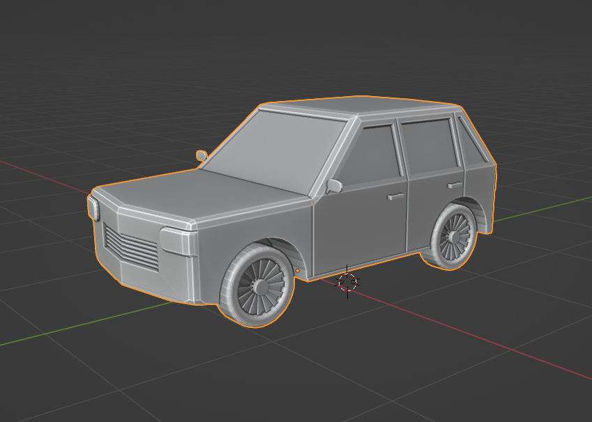
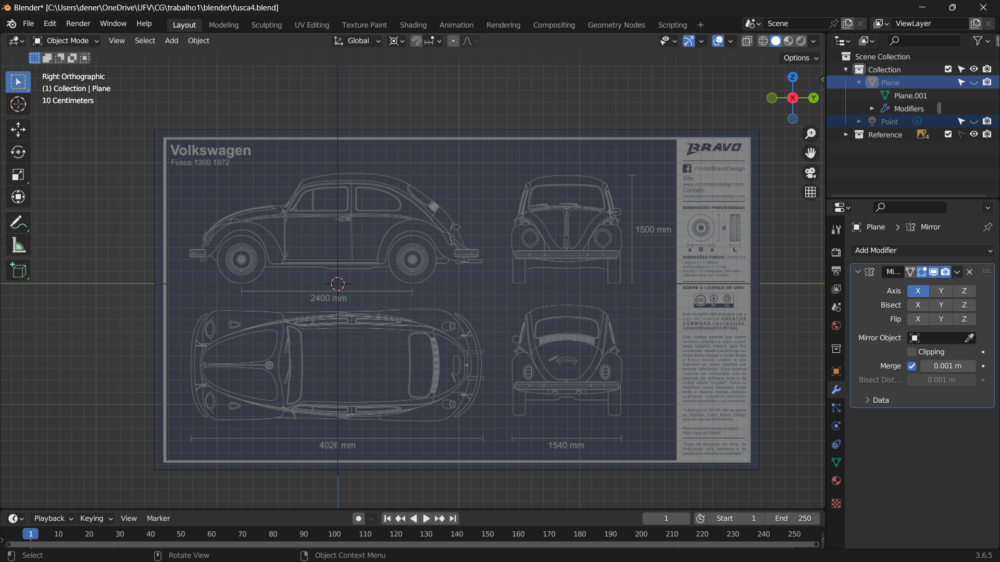
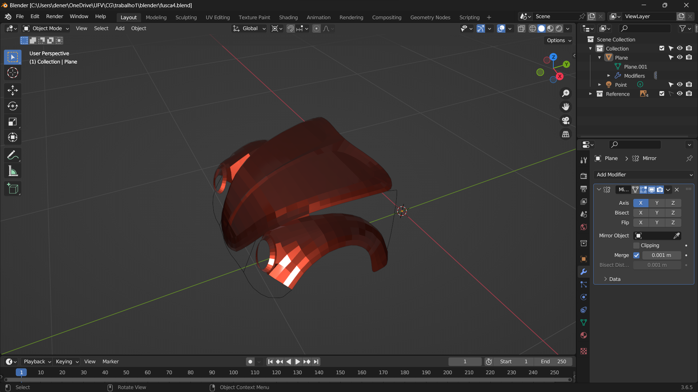
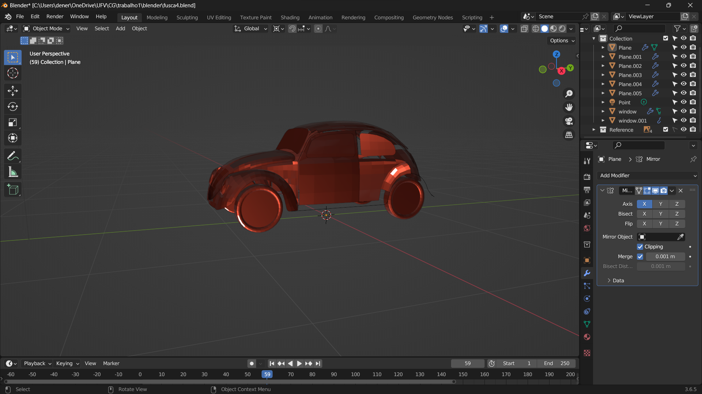
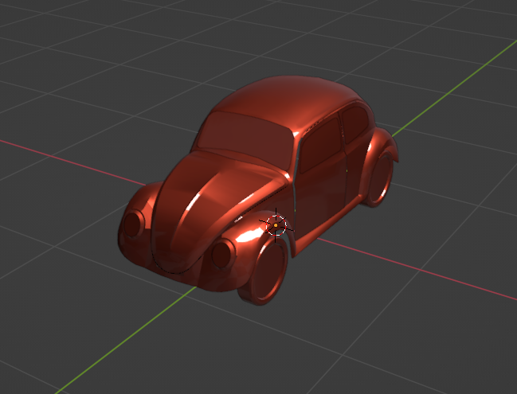
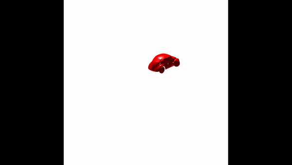
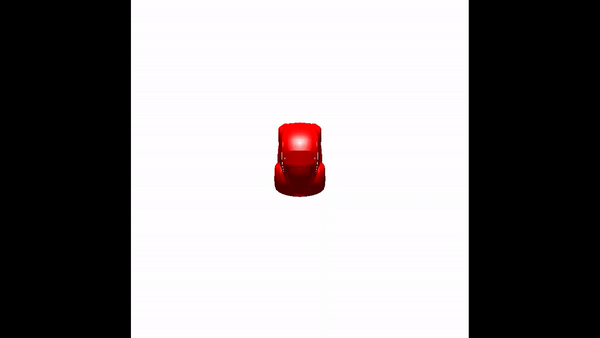

# Trabalho Prático 1

Neste trabalho foi desenvolvido um carro modelado em 3D no Blender e manipulado via código openGL. Deixarei descrito cada etapa do desenvolvimento.

## Modelo 3D

A modelagem em 3D foi feita para carro e terreno. A princípio, apenas o carro foi utilizado neste trabalho.

### Modelando o Carro

Primeiro foi modelado um carro simples, com poucos polígonos. A ideia foi conhecer o blender e seus comandos.



### Modelando um Carro Melhor (Fusca)

Para criar uma versão mais bonita e melhor do carro, foi utilizada uma blueprint que pode ser facilmente ser encontrada na internet. A partir desta imagem, foram criadas cada parte do carro. A ideia é que na próxima etapa do trabalho seja possível utilizar diferentes texturas para cada uma das partes.






### Modelando a Pista

Esta parte ficará mais bem explicada na próxima etapa do trabalho, onde serão realmente utilizadas as texturas.

## Desenvolvimento OpenGL

Depois de ter o carro modelado, foi utilizada a OpenGL para fazer o render do objeto. O passo a passo para alcançar este objetivo é descrito abaixo.

### Uma nova classe para carro

Foi criada a classe ```Car```, que herda de ```vector<object*>```. Esta classe é responsavel por manter as matrizes de modelo de cada objeto que compõe o carro (rodas, portas, vidros, etc...). Além disto, esta classe é responsável por ler os objetos do arquivo obj.

### Incrementando o Objeto

O arquivo ```object.h``` também foi modificado para adicionar uma nova informação nos objetos que é o centro de massa, valor que pode ser aproximado com a média das posições de cada vértice, assumindo uma distribuição constante de densidade (o que não é verdade na vida real, mas uma boa aproximação para o trabalho).

### Main

A main é responsável por manter as informações atuais de velocidade do carro, posição do volante e câmera. 

O funcionamento do carro é simples, basta a main passar as informações de velocidade e volante para a classe ```Car``` e esta computa as matrizes necessárias e atualiza o modelo.

Já a câmera, neste trabalho foram utilizados dois modos. O primeiro é como foi pedido no trabalho, a câmera acompanha o carro com um certo atraso para dar a percepção de movimento. O segundo modo é o modo de câmera fixa. Foi decidido adicionar este modo pois como não há textura, o movimento do carro com a câmera acompanhando não é tão perceptível.

## Interface com o usurário

Nesta seção será explicado como controlar o carro e a Câmera.

### Direita e Esquerda

O movimento da roda para direita e esquerda é feito pelas teclas 'd' e 'a' respectivamente. Existem 4 níveis de curva para cada um dos lados(8, 16, 24 e 32 graus). Cada clique numa das letras, altera a angulação da roda em 8 graus (ou até atingir o limite de 32 graus).

### Frente e Trás

O movimento para frente e para trás é feito com as teclas 'w' e 's' respectivamente. Existem 3 velocidades para frente e 1 velocidade para trás. Ao apertar 'w', a velocidade é incrementada em 0.25 e ao apertar 's' a velocidade é decrementada em 0.25. Note que velocidade negativa é o mesmo que andar para trás. 

A unidade de medida de velocidade é feita pela quantidade de graus que a roda **traseira** gira a cada TICK do relógio, ou seja, a cada update do modelo. Esta informação é importante pois a velocidade pode variar dependendo da velocidade do processador do computador.

### Modos da Câmera

O modo padrão da câmera é acompanhar o carro durante o movimento. Mas isso pode ser mudado usando **SHIFT + f**. Neste modo a câmera fica fixa e apenas o carro se move na cena. Para voltar para o original, basta apertar 'f'.

## Execução

Os resultados desta etapa do trabalho poder ser vistos executando o trabalho, mas existem dois vídeos exemplificando o funcionamento.

### Câmera Fixa



### Camera Model



## Desenvolvedor

Dener Vieira Ribeiro [github](https://github.com/deneribeiro10)